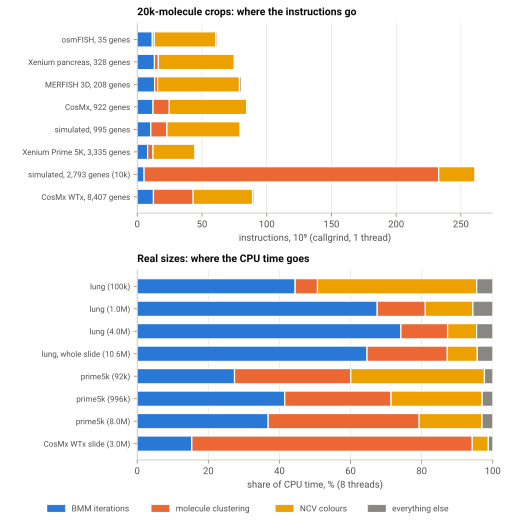

# Owner report: where the time goes, current bottlenecks

Generated by `docs_figures/make_figures.py` (not part of the public docs).
Profiling run: `$BAYSOR_BENCH_DATA/profiling/reports/2026-10-01-20bc45c`. The figure and the tables under "Data" are
regenerated from that run's summaries; the prose was written for the
2026-10-01 run (`20bc45c`) and quotes its numbers; re-check it against the
tables when the run changes.

## Where the time goes

**Figure.** Top: instructions per phase on 20k-molecule crops (callgrind,
1 thread). Bottom: share of the CPU time per phase at real sizes (gperftools,
8 threads). "BMM iterations" is the segmentation itself; "molecule
clustering" is the initial assignment of molecules to cell types (the MRF
clustering or, for whole-transcriptome panels, the neighbourhood-graph
clustering); "NCV colours" is the colour embedding used by the plots and the
`ncv_color` output column.

- On **small crops** the colour embedding dominates: 66–84 % of the
  instructions on every panel below 1,000 genes, mostly umappp's
  single-threaded layout optimisation. It costs a fixed amount (at most
  20,000 anchors), so it fades at real sizes: 8 % of the CPU time on the whole
  lung slide. Skip it with `--skip-ncv-color` if you do not need the colours.
- On **real slides** (1M molecules and more) the BMM iterations take
  37–74 % of the CPU time and molecule clustering 13–42 %; on the
  18,935-gene CosMx slide molecule clustering takes 79 %.
- The **dense ICA** behind the 2,793-gene crop's huge clustering bar is the
  1,000–3,000-gene case of the docs' Profiling › Gene panel size.

## Current bottlenecks

Ranked by their share of the CPU time at real sizes (whole lung slide and
Prime 5K 8M, 8 threads).

1. **BMM E-step** — about 35 % of the CPU on the whole lung slide (the E-step
   chunk, `CategoricalSmoothed::pdf` and `exp`). Linear and 99 % parallel:
   this is the algorithm's core work, not overhead.
2. **Molecule clustering** — 23 % (lung) and 42 % (Prime 5K 8M) of the CPU,
   super-linear (exponent 1.32), because the MRF clustering needs more
   iterations on larger slides.
3. **BMM bookkeeping** (splitting and grouping components, hash-map updates)
   — about 22 % of the CPU on the whole slide, mildly super-linear
   (exponents 1.2–1.4).
4. **NCV colour embedding** on small data — single-threaded, 61 % of the
   instructions on a 20k crop; negligible on slides. Use `--skip-ncv-color`
   when the colours are not needed.
5. **Gene-rich panels** — the neighbourhood k-NN with k = genes / 10 takes
   65 % of the CPU on the 18,935-gene CosMx slide, and panels of
   1,000–3,000 genes still run the dense O(genes³) ICA (87 % of the
   instructions on the 2,793-gene crop, single-threaded).

Memory at the whole-slide peak (5.06 GiB heap) is spread over the molecule
adjacency list (787 MiB), the assignment history (728 MiB), the MRF clustering
state (383 MiB) and three copies of the molecule positions (3 × 170 MiB).

## Data

Share of the CPU time per phase group, % (gperftools, 8 threads):

| rung | BMM iterations | molecule clustering | NCV colours | everything else |
|---|---:|---:|---:|---:|
| lung_100k | 44.4 | 6.3 | 44.8 | 4.5 |
| lung_1M | 67.5 | 13.5 | 13.4 | 5.6 |
| lung_4M | 74.2 | 13.1 | 8.2 | 4.5 |
| lung_all | 64.6 | 22.6 | 8.4 | 4.4 |
| prime5k_100k | 27.4 | 32.7 | 37.6 | 2.3 |
| prime5k_1M | 41.5 | 29.9 | 25.6 | 3.0 |
| prime5k_8M | 36.8 | 42.5 | 17.7 | 3.0 |
| cosmx_wtx_colon_full | 15.4 | 78.9 | 4.5 | 1.2 |

Instructions per phase group, 10⁹ (callgrind, 1 thread, 20k-molecule crops):

| crop | BMM iterations | molecule clustering | NCV colours | everything else |
|---|---:|---:|---:|---:|
| osmfish_g35_20k | 11.64 | 1.55 | 47.37 | 1.14 |
| xenium_pancreas_g377_20k | 13.30 | 3.02 | 58.66 | 1.02 |
| merfish_ileum_3d_20k | 13.45 | 2.27 | 63.25 | 1.40 |
| cosmx_nsclc_g960_20k | 12.21 | 12.52 | 59.74 | 1.00 |
| sim_circles_g1000_20k | 10.50 | 12.44 | 56.61 | 0.93 |
| xenium_prime5k_20k | 8.03 | 4.14 | 32.46 | 0.76 |
| sim_circles_g5000_10k | 5.29 | 227.55 | 28.13 | 0.57 |
| cosmx_wtx_20k | 12.53 | 30.66 | 45.88 | 1.18 |

Scaling exponents (value ∝ molecules^b, gperftools, 8 threads):

| phase | lung | prime5k |
|---|---:|---:|
| bmm_init | 0.91 | 0.91 |
| bmm_iterations | 1.15 | 1.10 |
| confidence | 1.04 | 1.10 |
| cpu_s | 1.08 | 1.07 |
| loading | 0.92 | 0.93 |
| mol_clustering | 1.32 | 1.23 |
| molecule_graph | 1.25 | 1.02 |
| ncv_colors | 0.71 | 0.86 |
| out_cell_stats | 0.90 | 0.94 |
| out_counts | 0.91 | 0.91 |
| out_molecules | 0.74 | 0.75 |
| out_polygons | 0.82 | 0.81 |
| peak_rss_kb | 0.73 | 0.59 |
| polygons | 1.24 | 1.38 |
| shutdown | 0.35 | 0.29 |
| startup | -0.06 | -0.11 |
| wall_s | 1.13 | 0.97 |
